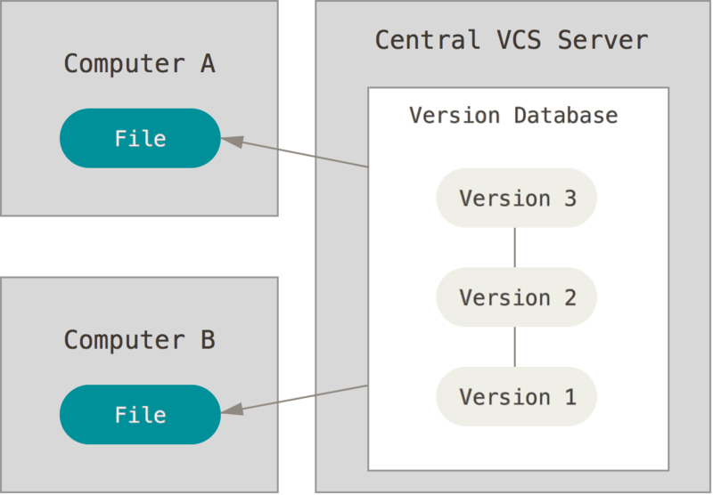

    

    

## Что есть система контроля версий

Что такое «система контроля версий» и почему это важно? Система контроля версий — это система, записывающая изменения в файл или набор файлов в течение времени и позволяющая вернуться позже к определённой версии. Для контроля версий файлов в этой книге в качестве примера будет использоваться исходный код программного обеспечения, хотя на самом деле вы можете использовать контроль версий практически для любых типов файлов.

Если вы графический или web-дизайнер и хотите сохранить каждую версию изображения или макета (скорее всего, захотите), система контроля версий (далее VCS) — как раз то, что нужно. Она позволяет вернуть файлы к состоянию, в котором они были до изменений, вернуть проект к исходному состоянию, увидеть изменения, увидеть, кто последний менял что-то и вызвал проблему, кто поставил задачу и когда и многое другое. Использование VCS также значит в целом, что, если вы сломали что-то или потеряли файлы, вы спокойно можете всё исправить. В дополнение ко всему вы получите всё это без каких-либо дополнительных усилий.

## Локальные системы контроля версий
Многие люди в качестве метода контроля версий применяют копирование файлов в отдельный каталог (возможно даже, каталог с отметкой по времени, если они достаточно сообразительны). Данный подход очень распространён из-за его простоты, однако он невероятно сильно подвержен появлению ошибок. Можно легко забыть в каком каталоге вы находитесь и случайно изменить не тот файл или скопировать не те файлы, которые вы хотели.

Для того, чтобы решить эту проблему, программисты давным-давно разработали локальные VCS с простой базой данных, которая хранит записи о всех изменениях в файлах, осуществляя тем самым контроль ревизий.

## А что же такое распределенная система контроля версий?

В DVCS (таких как Git, Mercurial, Bazaar или Darcs) клиенты не просто скачивают снимок всех файлов (состояние файлов на определённый момент времени) — они полностью копируют репозиторий. В этом случае, если один из серверов, через который разработчики обменивались данными, умрёт, любой клиентский репозиторий может быть скопирован на другой сервер для продолжения работы. Каждая копия репозитория является полным бэкапом всех данных.

## Побольше о самой Git

Основное отличие Git от любой другой системы контроля версий (включая Subversion и её собратьев) — это подход к работе со своими данными. Концептуально, большинство других систем хранят информацию в виде списка изменений в файлах. Эти системы (CVS, Subversion, Perforce, Bazaar и т. д.) представляют хранимую информацию в виде набора файлов и изменений, сделанных в каждом файле, по времени (обычно это называют контролем версий, основанным на различиях).

У Git есть три основных состояния, в которых могут находиться ваши файлы: изменён (modified), индексирован (staged) и зафиксирован (committed):

К изменённым относятся файлы, которые поменялись, но ещё не были зафиксированы.

Индексированный — это изменённый файл в его текущей версии, отмеченный для включения в следующий коммит.

Зафиксированный значит, что файл уже сохранён в вашей локальной базе.

Мы подошли к трём основным секциям проекта Git: рабочая копия (working tree), область индексирования (staging area) и каталог Git (Git directory).

Рабочая копия является снимком одной версии проекта. Эти файлы извлекаются из сжатой базы данных в каталоге Git и помещаются на диск, для того чтобы их можно было использовать или редактировать.

Область индексирования — это файл, обычно находящийся в каталоге Git, в нём содержится информация о том, что попадёт в следующий коммит. Её техническое название на языке Git — «индекс», но фраза «область индексирования» также работает.

Каталог Git — это то место, где Git хранит метаданные и базу объектов вашего проекта. Это самая важная часть Git и это та часть, которая копируется при клонировании репозитория с другого компьютера.

## Как работать с Git

Базовый подход в работе с Git выглядит так:

Изменяете файлы вашей рабочей копии.

Выборочно добавляете в индекс только те изменения, которые должны попасть в следующий коммит, добавляя тем самым снимки только этих изменений в индекс.

Когда вы делаете коммит, используются файлы из индекса как есть, и этот снимок сохраняется в ваш каталог Git.

Если определённая версия файла есть в каталоге Git, эта версия считается зафиксированной (committed). Если файл был изменён и добавлен в индекс, значит, он индексирован (staged). И если файл был изменён с момента последнего распаковывания из репозитория, но не был добавлен в индекс, он считается изменённым (modified). В главе Основы Git вы узнаете больше об этих состояниях и какую пользу вы можете извлечь из них или как полностью пропустить часть с индексом.